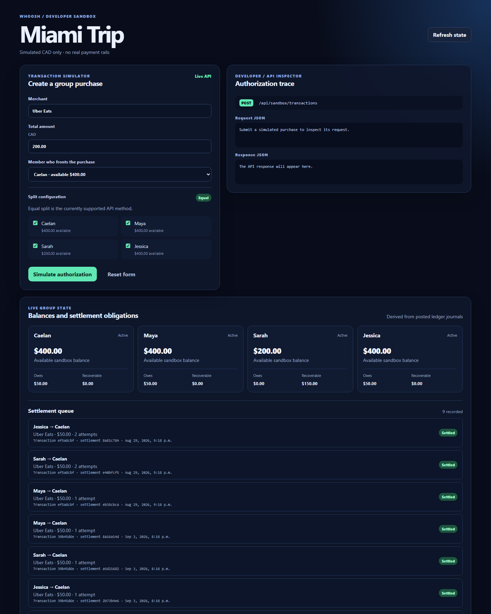

# WHOOSH

Group payment infrastructure sandbox for simulating shared purchases, authorization logic, ledger updates, and settlement workflows.

WHOOSH explores a payment model where group expenses are handled as part of the authorization flow instead of being settled manually afterward.

The current prototype uses simulated CAD balances only and does not connect to real payment rails.

## Deployment

WHOOSH is intentionally a standalone application; deploy this repository as its
own Vercel project and link to its Vercel URL from a portfolio. The frontend and
Express API deploy together on Vercel: the browser calls same-origin `/api/*`
and Vercel routes those requests to `api/[...path].ts`. PostgreSQL is the only
external service required. A free [Neon](https://neon.tech) database is a good
fit because it provides serverless Postgres.

1. Create a free Neon project and copy its **pooled** connection string.
2. Import this GitHub repository into Vercel. Leave the project root as the
   repository root; Vercel reads `vercel.json` for the build and output settings.
3. In Vercel → Settings → Environment Variables, add `DATABASE_URL` with the
   pooled Neon connection string and `DATABASE_URL_UNPOOLED` with the direct
   Neon connection string. The app uses the pooled URL; the build uses the
   direct URL for Drizzle migrations. `PORT` and `VITE_API_URL` are not needed
   for this all-in-one deployment.
4. Deploy. The build runs the committed Drizzle migrations before the frontend
   build. Open `/api/health` after deployment to confirm the function is live.
   Then add `CORS_ORIGIN` with the final Vercel URL (for example,
   `https://whoosh-demo.vercel.app`) and redeploy. This is only relevant to
   cross-origin clients; the deployed web app calls the API on the same origin.
5. Use the resulting `https://<your-project>.vercel.app` URL for **Launch
   interactive sandbox** in the portfolio. Do not add WHOOSH files to the
   portfolio repository.

For a deliberately split deployment, set `VITE_API_URL` to the API's HTTPS URL
when building the frontend and set `CORS_ORIGIN` on the API to the exact Vercel
frontend URL. Do not use `*` for this public sandbox.

### Sandbox data and reset behaviour

On a visitor's first load, the browser creates a private demo group with four
fictional members and clearly simulated CAD balances. Its group ID is stored in
that browser's local storage; no authentication or real payment credentials are
involved. **Reset sandbox** creates a new group and replaces the stored ID, so
one visitor cannot alter another visitor's balances or settlement queue. The
database is persistent by design; no API state relies on server memory.

### Environment variables

Copy `.env.example` to `.env` for local work. `.env` files are ignored and must
not be committed. `DATABASE_URL` is server-only—never use a `VITE_` prefix for
it. `VITE_API_URL` is optional and contains only a public API URL when the API
is separately hosted.

## Demo

The developer sandbox lets you simulate a group purchase and inspect the full flow:



- choose a merchant
- enter a transaction amount
- select participating members
- choose who fronts the purchase
- simulate authorization
- inspect the API request and response
- view updated member balances
- view generated settlement obligations
- process pending settlements
- simulate settlement failures such as insufficient funds

Example:

```text
Merchant: Uber Eats
Amount: $200 CAD
Participants: 4
Fronting member: Sarah
Split method: Equal
```
